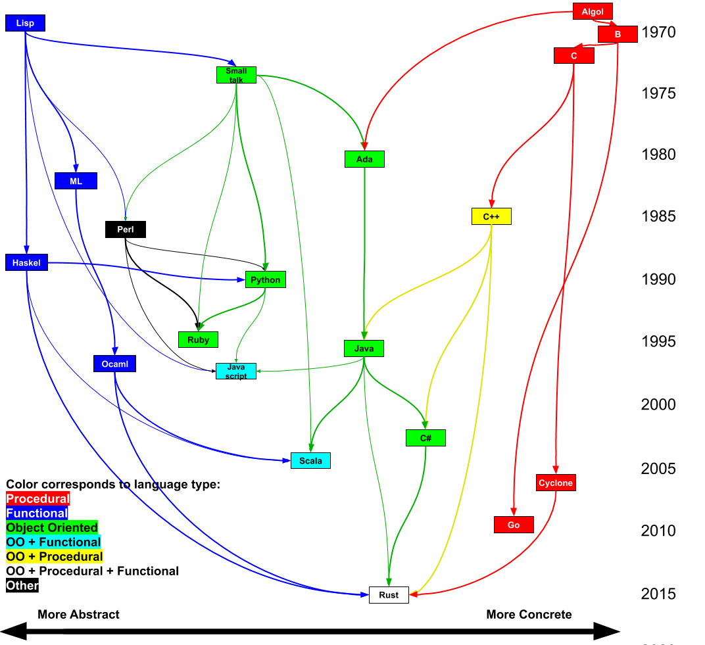

# History of Rust

<table style="background: maroon; color: white">
<tr>
<td>

<b>
The Beast adopted <em style="font-size:1.2em;line-height:0">new raiment</em> and studied the ways of <em style="font-size:1.2em;line-height:0">Time</em> and
<em style="font-size:1.2em;line-height:0">Space</em> and <em style="font-size:1.2em;line-height:0">Light</em> and the <em style="font-size:1.2em;line-height:0">Flow</em> of energy through the Universe.
From its studies, the Beast fashioned new structures from <em style="font-size:1.3em;line-height:0">oxidised metal</em> and proclaimed
their glories. And the Beast’s followers rejoiced, finding renewed purpose in these <em style="font-size:1.2em;line-height:0">teachings</em>.
</b>

*-- The Book of Mozilla, 11:14*
</td>
</tr>
</table>

## Prehistory

The history of programming is one of ever increassing levels of abstraction. Electrial signals were abstracted into instructions. CPU instructions were abstracted by assembly languages. The next innovation was proceedural programming. This provided a layer of abstraction helps avoid errors in flow control. Soon after their creation soon almost all programing was done in proceederal languages. 

Proceedural programming is great for reasoning about flow control, but the introduction of variables which provide a useful name and abstract over registers and memory addresses intruduces a source of potential problems: It is often desireable or nessicary to have two variables refer to the same thing, and it is possible to forget that is the case. This seems subtle at first, but this problem of shared state, speffically shared *mutable* state, has become the root of most bugs.

It might not seem obvious that this is the case, after all it's usually simple enough to keep things strait. But shared mutable state manifests in a lot of different ways. In C++ these show up as:
* Dangling pointers
* Use after free bugs
* Segfaults
* Iterator invalidation
In Java you see:
* Null pointer exceptions
* Concurrent modification exceptions
* Race conditions
* The need for synchronized blocks
* The need for a garbage collector
* The need for a JIT compiler because many optimizations can't be reasoned about from the code

There were two major responses to dealing with the problem of shared mutable state. Functional programming which sought to remove the mutability, and write code using only immutable shared data. Object oriented programming which sought to use encapsulation to prevent state from being shared, while maintaining mutability.

Both approaches have been developed over the course of decades. Now they both work quite well. However they usually don't work together. Because if nieevly combining ideas from the two results in shared mutable state, which loses the benefit of either approach. So while there have been many ideas that have crossed over from OO languages to Functional languages and vice versa, the have been limited and adapted to the language they are in, and in general don't achieve the same effect they do in the language they came from.

The most important idea in Rust is to go beyond this dichotomy. By allowing state to be mutable and shared, but not at the same time Rust can bring the full power of Object Orientation and Functional programming to bare in the same language at the same time. This allows for:
* Memory safety without Garbage collection
* High level abstraction without overhead
* Compile time prevention of all NPEs, CMEs, Resource leaks, and Race conditions.
More importantly Rust opens the door to future paradigms and design patterns that just wouldn't be practical in other languages because they would be too error prone.

## History of Rust 

Work on Rust began in earnest in 2009 at Mozilla based on a prototype that Graydon Hoare had been working on for a few years previously. After three years of development the first pre-alpha version of the compiler was released in 2012. 

Shortly after the first release Graydon stepped back from the project. This change was a hugely important milestone, because it allowed other people step up. This allowed the project to move to a open governance model, with many people providing different perspectives. Over the next three years the language changed, a lot. New features were added and more importantly several features were removed or moved into third party libraries. These changes dramatically improved the language, because it turns out a lot of ideas that sound great don’t turn out so well in practice. 

Rust’s evolution because changes were always anchored in very practical concerns as the core team spent most of their time working on Firefox. (a 4.4 million line C++ code base.) Eventually, in 2015 Rust 1.0 was released. This marked the first point where code could be written and still compile later. This marked a major change from pre-1.0 where if code that was more than 6 months old, you might as well rewrite it because the language was changing so quickly. 

Since 2015 many features were added or modified, or moved out into libraries, but compatibility was always maintained. However overtime, things arose that would be better if compatibility could be broken. So to maintain their release frequency, and to avoid getting stuck in the compatibility trap that a lot of languages find themselves in, the Rust project team settled on a release system, where compatibility would with old versions would be maintained, but every three years a backwards incompatible changes would be introduced in a new ‘epoch’. The ‘epoch’ is specified explicitly and multiple different ones can co-exist in the same program. So the language can be stable, but without stagnating. 

As of this writing the latest version is the 2018 release which contains a lot of improvements over Rust 1.0. It has been a rare pleasure to watch Rust continue to make rapid and significant improvements even as it’s usage grows. I believe this is a big part of why it was voted the “Most Loved Language” in the StackOverflow developer survey in 2016, 2017, and 2018. The percent of developers who have used it has grown each year, and the percentage of those who ‘love it’ has grown each year also. 

As the name implies Rust isn’t about new ideas. It’s about taking well established and vetted ideas, and putting them together in a coherent way. Almost nothing in Rust is completely original. So in this guide you will see lots of familiar concepts, but they fit together very well. In large part this is due the fact that during its history Rust very aggressivly explored a lot of possible design space. It has had a very fast release cycle, and gone through many rounds of expermentation, design and redesign. The features that have landed have had tremendious amount of thought put into how they fit in and work together and in most cases many alternitive approaches were tried and rejected. 

## Geneology of Rust
Below is a chart of what languages influenced which other languages. Arrows go from the influencing language to the one influenced. Time moves from top to bottom. The left-right axis represents how abstract vs concrete the language is. Finally the languages are color coated by their type.

While it might not be immediately obvious from looking a random code sample. As can be seen in the genealogy above, that Rust and Java are actually closely related. Rust draws heavily from Java's most influential predicessor C++ as well as C# which was very heavily influenced by Java. Java's philosophy of safety is also present throughout Rust.

Java was the first popular language to embrace the idea of safety. Unlike lower level languages Java prohibits users from directly manipulating memory or doing other dangerous operations, and unlike a lot of other high-level language is it has a strong type system which ensures that you don't get errors at runtime that could be caught earlier. Rust takes this idea of safety and really runs with it. It aims to prevent as many bugs as possible from reaching production by making incorrect code impossible to write. So like Java it prevents use of uninitialized memory, dangling pointers, use after free, memory leaks. Similarly Rust also provides exception safety, and prevents type errors through static type checking with generics. But Rust goes further and also prevents iterator invalidation / ConcurrentModificationExceptions, null pointers, resource leaks, ordering bugs due to static initialization or partial initialization, and data races in multi threaded code.

Rust’s primary goal is to prevent errors. If it is possible errors should be prevented at compile time. 

<table width="100%">
<tr>
<td> 

</td>
<td width="80%">

> *The safest program is the program that doesn't compile*
</td>
</tr>
</table>

Portability
Java has a goal that you should build your code once and be able to run anywhere Rust doesn't quite have the same goal: it has the goal that you should be able to write your code once, compiler it many times, and have it run almost anywhere. Rust compiles to native code on each platform it supports which as of today is 23 CPU architectures, Windows, MacOS, Linux, Bsd, all major web browsers, Android, iOS, and even several different micro controllers. Part of the reason that Rust is able to be ond so many architectures is that it is self-hosting. The Rust compiler is written in Rust. The standard library is also written in Rust and it depends on very little native code. Rust even brings its own memory allocator. Because Rust compiles using llvm, as long as there is an llvm target available for a system, Rust can target it.

Performance
Usability
  * Be a Good language
    * Safe, concurrent, practical
    * We can have nice things:  https://blog.rust-lang.org/2017/03/02/lang-ergonomics.html
  * Be usable
    * Many platforms
    * Package management
    * Build system and test harness
    * Fast enough that you won't need anything else.
  * Pillars of rust
    * Speed without wizardry 
      * http://fitzgeraldnick.com/2018/02/26/speed-without-wizardry.html
    * Memory safety without garbage collection
    * Concurrency without data races
    * Abstraction without overhead
    * Stability without stagnation
      * No unexpected changes to language and functionality
        * Across versions
        * By depending on something
    * Hack without fear. 
      * Confident systems programming
    * Rust: fast, reliable, productive—pick three.
    * Zero cost abstractions
      * 4 compiler optimization phases.
      * Normal code is just as fast as unsafe if you can explain to the compiler why it is safe
      * Zero size types mean hashMap<k,()> == set<> with not overhead.
  * API guidelines https://rust-lang-nursery.github.io/api-guidelines/
    * https://deterministic.space/elegant-apis-in-rust.html
    * Don't use booleans in API use named enums. It is more readable at the call site.
  * Rust is implemented in Rust.
    * Look at String, or Vec, or Exceptions, or Channels or anything else, it’s written in pure rust. 
    * THere are a number of primitives but all of the standard library is built on just these primitives. It doesn’t break out into some other language or ‘native’ code. 
    * For example, you can perform a lot of fancy operations on Strings. But a lot of those actually just come from iterator, which automatically provides a lot of functionality for types that implement it. But Strings implementation of iterator isn’t some special native code, in fact String itself is just a Vec of UTF-8 characters. Vec is itself is a struct.
    * This allows Rust to be compiled and built in Rust, but more importantly it has forced those primitives on which the language is build to be sufficiently robust and flexible to support everything above them. And when one of those basic building blocks improves, everything above them benefits.
  * Rust itself if a somewhat complicated language. It has a lot of features, more than Java (Though not as many a c++). But this is everything. The standard library is built using just these primitives, and compared to most languages (Especially Java) it’s standard library is small. Most of the features are developed externally to the language itself. Even things you wouldn’t necessarily expect, like Non-blocking IO, Concurrency support, and even Exceptions. 
    * This allows these components to be versioned independently and evolve more quickly than the language itself. It also allows competing libraries to replace them when they have a superior design.
    * Key to making this work is a built in dependency management system: Cargo. There will be a full chapter on it later.
  * Culture of documentation
  * Culture of testing
  * Culture of inclusivity
  * Clippy

## What makes a good language?

  * Code can be imagined as shapes
    * Width is interface complexity
    * Depth is complexity of problem
    * Volume is proportional to code volume 
      * Some languages are more concise and others more verbose, but this doesn't matter
    * Narrow and Deep is better
    * Too shallow is worse than useless
  * The best language is the one in which you write the best code.
    * Code can have problems:
    * Redundant
    * Interface covers things the impl doesn't
    * Interface is complicated
    * Poorly factored
  * It is better if a language allows you to make three transformations
    * Factor out code
    * Generalize
    * Refine interface (eliminate unsupported features)
    * Shrink width (reducing impl)
    * Shrink interface preserving volume.
  * A language feature is good if it let's you do these things.
    * It is bad if it causes the reverse
      * Example: exceptions and futures together.
  * Some languages enable all the things, others say none of them
  * To decide which are good think in terms of a standard library.
    * Where to draw the line?
    * To the left slows discourages improvement by impeding replacement and slowing development
    * To the right causes distribution issues.
    * For Java including a large stdlib was great… at first
    * Today we have deps management tools. So j2ee and similar things are now out. If this were the norm in 1995 java would be different.
    * This refactoring visualized
      * From the perspective of any given developer
  * Language features and the stdlib and the languages interface. 
  * A language is just like any other program, it's just more important to get right.
    * It is bad if It has coupling with other features, causing the interface of the language, or worse application code to expand. (For this reason it is important that features be orthogonal and well factored) this is true of all interfaces but for a language it is more important because they have a lot of dependant code.
    * Causes ambiguity about what something does
    * Is easily confused with another feature/behaviour in the same language
    * Introduces inconsistency: An internal library can do something but a user library can’t copy that code and have it work
    * Forces additional complexity anywhere it isn’t used
    * Introduces a source of potential bugs
    * Causes a runtime failure, in the event that the user’s code is using it incorrectly
    * Makes errors go undetected
    * Forces repetition that can’t be factored out
  * So a feature is good in a language if adding it:
    * Hide a lot of complexity behind a simple interface (ie: is just good code)
    * If it can't be implemented in application code and be effective. (Note this may be a red flag, as we want the minimal set)
    * Shrinks the overall interface by allowing code to be moved out. (As in the above example)
    * If it allows external code to shrink their interfaces
    * If it allows for external code to refine their interfaces
    * Serves can’t be met by normal library or application code
    * Moves bugs from latent to explicit, or from runtime to compile time
  * Great features:
    * Interfaces and polymorphism
    * Generics
      *  Constraint Based Generics and Parametric Polymorphism
    * Symbols for complex but well defined tasks that can be plugged into
      * enhanced for loop
      * Try / with resources
      * Functional interfaces
    * Exceptions
      * Algebraic Types and Type-safe Failure Modes
    * Rust feature: Algebraic Types and Type-safe Failure Modes (more on this later)
    * Type Inference
      * Rust uses the Hindley-Milner type system, which is considered the best at this.
    * Immutability
      * Better: Immutable by default.
      * Even better: Marking when data is modified.
    * Pattern Matching and Compound Expressions
    * Isolating dangerous / low level operations
    * https://yager.io/programming/go.html 
